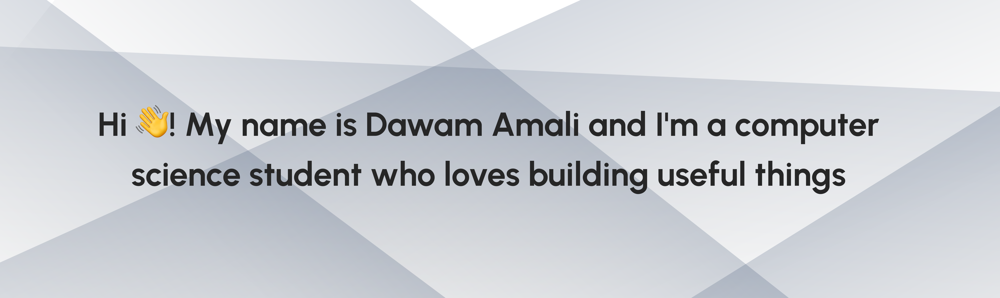

                                                                                               
                                                                                                                                                                 
  
                                                                                                                                           
                                                                                                                                                                 
  <h1>Hi, I'm Muhammad Dawam Amali</h1>                                                                                                                        
    
                                                                                                                                                          
      Full-stack web developer focused on building polished, production-ready web experiences.                                                                   
    
                                                                                                                                                         
                                                                                                                                                                 
   <a href="mailto:muhammadawamali@students.amikom.ac.id">                                                                                                      
      
    </a>                                                                                                                                                         
    <a href="https://www.linkedin.com/in/muhammad-dawam-amali-7487ab28b/">                                                                                       
                                      
    </a>                                                                                                                                                         
                                                 
                                                                                                                                                                 
  
                                                                                                                                                         
                                                                                                                                                                 
  ---                                                                                                                                                            
                                                                                                                                                                 
  ### About                                                                                                                                                      
                                                                                                                                                                 
        
                                                                                                                                                                 
  - Building with **Next.js**, **React**, **Laravel**, and **TypeScript**                                                                                        
  - Comfortable across frontend, backend, admin dashboards, and VPS deployment
  - Interested in clean interfaces, practical architecture, and production workflows                                                                             
  - Currently improving full-stack delivery, performance, and developer experience                                                                               
                                                                                                                                                                 
                                                                                                                                              
                                                                                                                                                                 
  ---                                                                                                                                                            
                                                                                                                                                                 
  ### Tech Stack                                                                                                                                                 
                                                                                                                                                                 
  
                                                                                                                                             
                                 
    
                                 
                                                                                                                                               
                                                
    
                                            
                                                                                                                                               
                                          
                                                                                                                                               
                                             
                                                                                                                                               
                                             
                                                                                                                                               
                                                 
  
                                                                                                                                                         
                                                                                                                                                                 
  ---                                                                                                                                                            
                                                                                                                                                             
 ## Profile Summary                                                                                                                                             
                                                                                                                                                                 
  
                                                                                                                                           
                  
                
              
  
                                                                                                                                                              
                                                                                                                                                                 
  
                                                                                                                                           
                                                                                                                                                               
  
    
                                                                                                                                                                 
  ---                                                                                                                                                            
                                                                                                                                                                 
  ### Achievements                                                                                                                                               

  
                                                                                                                                           
                                                                                                                                                       
  
                                                                                                                                                         

  ---                                                                                                                                                            
                                                                                                                                                                 
  ### Activity                                                                                                                                                   
                                                                                                                                                                 
                                                                                                                                                        
                                                                                                                                                                 
  ---                                                                                                                                                            
                                                                                                                                                                 
  
                                                                                                                                                      
    
<b>What I Usually Work On</b>
                                                                                                             
                                                                                                                                                                 
                                                                                                                                                          
                                                                                                                                                                 
  - Public-facing web interfaces                                                                                                                               
    - Admin dashboards and CMS-like tools                                                                                                                        
    - Laravel REST APIs                                                                                                                                          
    - Next.js frontend integration                                                                                                                               
    - VPS deployment with Nginx, PM2, MySQL, and SSL                                                                                                             
    - UI polish, media handling, and performance cleanup                                                                                                         
                                                                                                                                                                 
  
                                                                                                                                                     
                                                                                                                                                                 
  
                                                                                                                                                      
    
<b>GitHub Contribution Notes</b>
                                                                                                          
                                                                                                                                                                 
                                                                                                                                                           
                                                                                                                                                                 
   Some private or organization work may appear as anonymized private contributions depending on GitHub profile settings.                                       
                                                                                                                                                                 
  Contribution graph updates are not always instant and can take up to 24 hours.                                                                               
                                                                                                                                                                 
  

                                                                                                                                                                 
  ---
                                                                                                                                                                 
  <picture>                                                                                                                                                      
    <source media="(prefers-color-scheme: dark)" srcset="https://raw.githubusercontent.com/seafood99/seafood99/output/github-snake-dark.svg" />                  
    <source media="(prefers-color-scheme: light)" srcset="https://raw.githubusercontent.com/seafood99/seafood99/output/github-snake.svg" />                      
                                      
  </picture>                                                                                                                                                     
                                                                                                                                                                 
